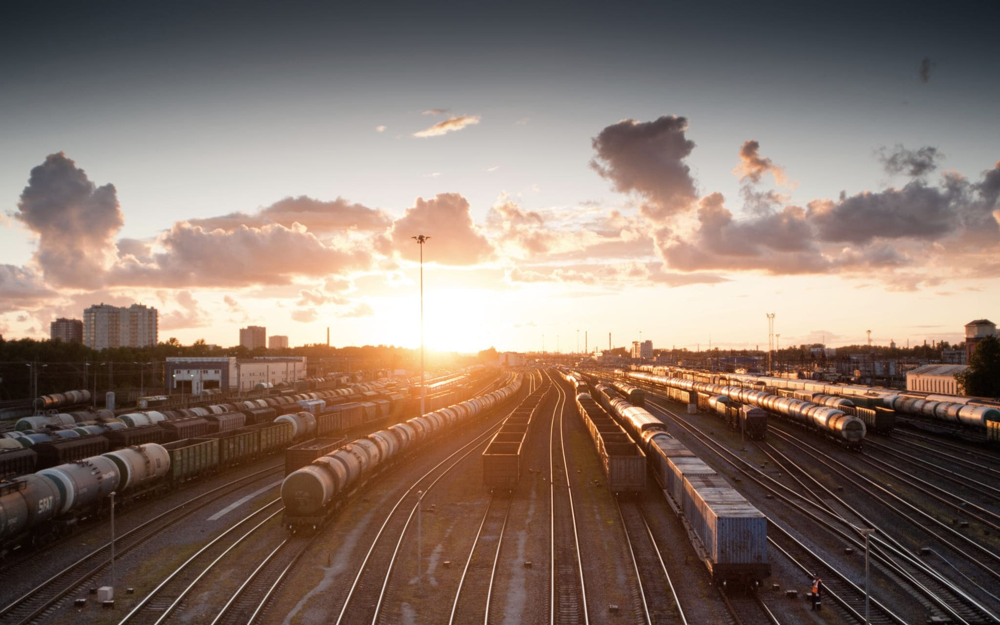

# Проект 3: Путешествие по России

### Обзор
* Интро
* Figma
* Ссылка на проект

**Интро**

Здесь будет проект о путешествии по России.

**Figma**

* [Ссылка на макет в Figma](https://www.figma.com/file/5S2WSbEFL6awjVWJ0NWL8Q/Sprint-3_-Russia-_-desktop-mobile?node-id=28503%3A0)

**Картинки**

Доставать картинки предстоит из Фигмы. Это расхожая практика, поэтому полезно потренироваться.
Не забудьте [оптимизировать картинки](https://tinypng.com/), чтобы ваш сайт загружался быстрее.

Удачи!

**Ссылка на проект**

https://rainbowpieeee.github.io/russian-travel/index.html

<a href="https://stampsy.com/na-elektrichkakh-do-baikala" class="cover__overlay">
          
          <h2 class="cover__title">До Байкала "на собаках"</h2>
          
По мотивам учебной темы о Транссибе - путешествие от столицы до Байкала на электричках

      </a>
